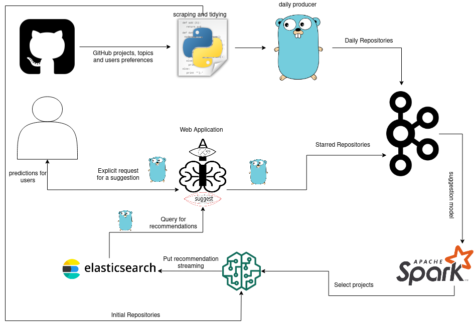

# AISuggestU
<p align="center"></p>

Project about reccomendation systems, primarily GITHUB, hoping to continue with other sources

<p align="center"></p>

# Requirements
- Docker
- Docker Compose

# Usage
First of all clone the project:
```
git clone https://github.com/josura/AISuggestU
```
Then run Zookeeper and Kafka:
```
docker-compose up zoo kafka
```

Run ElasticSearch:
```
docker-compose up elastic-search
```

Run Spark Consumer:
```
docker-compose up spark-consumer-classifier
```

Run Web Application:
```
docker-compose up web
```

Run Kibana(optional):
```
docker-compose up kibana
```

# Built with
- [Kafka](https://kafka.apache.org/)
- [Spark](https://spark.apache.org/)
- [ElasticSearch](https://www.elastic.co/)
- [Beego](https://beego.me/)
- [Kibana](https://www.elastic.co/kibana)